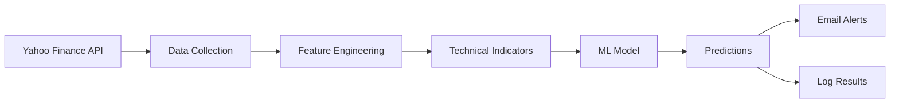

# 📊 Market Monitor - AI-Powered Stock Prediction Automation

An end-to-end automated system for daily stock market predictions using machine learning, featuring email notifications and a Streamlit web interface.


## 🎯 Features

- **🤖 AI-Powered Predictions**: Multiple ML models (Random Forest, XGBoost, LightGBM)
- **📧 Email Notifications**: Daily predictions sent to subscribers
- **📈 Performance Tracking**: Monitor model accuracy over time
- **🌐 Web Interface**: Beautiful Streamlit dashboard for subscriptions and analytics
- **⚙️ Automated Pipeline**: GitHub Actions runs predictions daily
- **📊 Technical Analysis**: 30+ technical indicators (RSI, MACD, Bollinger Bands, etc.)

## 🏗️ Project Structure

```
market_automation/
├── .github/
│   └── workflows/
│       └── daily_monitor.yml      # GitHub Actions workflow
├── data/
│   ├── raw_market_data.csv        # Raw historical data
│   ├── processed_market_data.csv  # Processed features
│   └── subscribers.json           # Email subscribers
├── logs/
│   └── predictions.log            # Daily prediction logs
├── models/
│   ├── model.pkl                  # Trained ML model
│   ├── scaler.pkl                 # Feature scaler
│   └── model_metadata.json        # Model information
├── notebooks/
│   ├── 01_data_collection_and_eda.ipynb
│   └── 02_model_building.ipynb
├── scripts/
│   └── monitor.py                 # Daily automation script
├── streamlit_app/
│   └── app.py                     # Streamlit web application
├── requirements.txt
└── README.md
```

## 🚀 Quick Start

### 1. Clone the Repository

```bash
git clone <your-repo-url>
cd market_automation
```

### 2. Install Dependencies

```bash
pip install -r requirements.txt
```

### 3. Run the Notebooks

**Step 1: Data Collection & EDA**
```bash
jupyter notebook notebooks/01_data_collection_and_eda.ipynb
```
- Fetches historical stock data
- Performs exploratory data analysis
- Engineers technical indicators
- Saves processed data

**Step 2: Model Building**
```bash
jupyter notebook notebooks/02_model_building.ipynb
```
- Trains multiple ML models
- Compares model performance
- Saves best model as `model.pkl`

### 4. Test the Monitor Script

```bash
python scripts/monitor.py
```

This will:
- Load the trained model
- Fetch latest market data
- Make predictions
- Log results
- (Optional) Send email alerts

### 5. Run the Streamlit App

```bash
cd streamlit_app
streamlit run app.py
```

Access the web interface at `http://localhost:8501`

## 📧 Email Configuration

To enable email notifications, set these environment variables:

```bash
export SMTP_SERVER="smtp.gmail.com"
export SMTP_PORT="587"
export SENDER_EMAIL="your-email@gmail.com"
export SENDER_PASSWORD="your-app-password"
```

**For Gmail:**
1. Enable 2-factor authentication
2. Generate an "App Password" in your Google Account settings
3. Use the app password (not your regular password)

## ⚙️ GitHub Actions Setup

### 1. Push to GitHub

```bash
git init
git add .
git commit -m "Initial commit"
git branch -M main
git remote add origin <your-github-repo>
git push -u origin main
```

### 2. Configure Secrets

Go to your GitHub repository:
- Settings → Secrets and variables → Actions
- Add the following secrets:
  - `SMTP_SERVER`
  - `SMTP_PORT`
  - `SENDER_EMAIL`
  - `SENDER_PASSWORD`

### 3. Enable GitHub Actions

The workflow in `.github/workflows/daily_monitor.yml` will:
- Run daily at midnight UTC
- Fetch latest data
- Make predictions
- Send emails to subscribers
- Commit logs back to the repository

### Manual Trigger

You can manually trigger the workflow:
- Go to Actions tab in GitHub
- Select "Daily Market Monitor"
- Click "Run workflow"

## 🌐 Streamlit Deployment

### Deploy to Streamlit Cloud

1. Push your code to GitHub
2. Go to [share.streamlit.io](https://share.streamlit.io)
3. Sign in with GitHub
4. Click "New app"
5. Select your repository
6. Set main file path: `streamlit_app/app.py`
7. Click "Deploy"

Your app will be live at: `https://<your-app>.streamlit.app`

## 📊 How It Works

### Data Pipeline



### Features Generated

1. **Moving Averages**: MA_5, MA_10, MA_20, MA_50
2. **Exponential MA**: EMA_12, EMA_26
3. **MACD**: MACD, MACD_Signal
4. **RSI**: Relative Strength Index (14-day)
5. **Bollinger Bands**: Upper, Middle, Lower
6. **Price Features**: Daily returns, price range, price change
7. **Volume Features**: Volume ratio, volume moving averages
8. **Volatility**: 20-day rolling standard deviation
9. **Lag Features**: Previous 1, 2, 3, 5, 7 days

## 🎯 Model Performance

The system trains and compares multiple models:

- Linear Regression
- Ridge Regression
- Lasso Regression
- Decision Tree
- Random Forest
- Gradient Boosting
- XGBoost
- LightGBM

The best model is automatically selected based on Test RMSE.

## 📈 Usage Examples

### Subscribe to Alerts

1. Open the Streamlit app
2. Go to "Subscribe" page
3. Enter your email
4. Click "Subscribe"

You'll receive daily emails with:
- Current price
- Predicted next-day price
- Expected change ($ and %)
- Technical indicators (RSI, MACD)

### View Performance

1. Go to "Performance" page in the app
2. See prediction trends over time
3. Analyze accuracy metrics
4. Review recent predictions

## 🔧 Customization

### Change Stock Ticker

Edit `scripts/monitor.py`:
```python
self.ticker = 'AAPL'  # Change to any ticker (e.g., 'TSLA', 'GOOGL')
```

### Adjust Schedule

Edit `.github/workflows/daily_monitor.yml`:
```yaml
schedule:
  - cron: '0 0 * * *'  # Change schedule (uses cron syntax)
```

Examples:
- `'0 0 * * *'` - Daily at midnight
- `'0 9 * * 1-5'` - Weekdays at 9 AM
- `'*/30 9-16 * * 1-5'` - Every 30 min during market hours

### Add More Features

Edit the `engineer_features()` function in both:
- `notebooks/01_data_collection_and_eda.ipynb`
- `scripts/monitor.py`

## 🐛 Troubleshooting

### Model file not found
```bash
# Make sure you ran the model building notebook
jupyter notebook notebooks/02_model_building.ipynb
```

### Email not sending
- Check environment variables are set
- Verify SMTP credentials
- For Gmail, use App Password (not regular password)

### GitHub Actions failing
- Check repository secrets are configured
- Verify workflow file syntax
- Check Actions logs for detailed errors

## 📝 Best Practices

1. **Data Quality**: Ensure clean, consistent data
2. **Model Retraining**: Retrain monthly with new data
3. **Feature Selection**: Remove redundant/low-importance features
4. **Validation**: Use walk-forward validation for time series
5. **Risk Management**: This is a tool, not financial advice

## ⚠️ Disclaimer

**This project is for educational purposes only.**

- Not financial advice
- Past performance ≠ future results
- Always do your own research
- Consult a financial advisor before investing
- Use at your own risk

## 📜 License

MIT License - feel free to use and modify!

## 🤝 Contributing

Contributions welcome! Please:
1. Fork the repository
2. Create a feature branch
3. Make your changes
4. Submit a pull request

## 📞 Support

- **Issues**: Open an issue on GitHub
- **Questions**: Start a discussion
- **Email**: [Your contact email]

## 🎓 Learning Resources

- [Scikit-learn Documentation](https://scikit-learn.org/)
- [XGBoost Guide](https://xgboost.readthedocs.io/)
- [Streamlit Documentation](https://docs.streamlit.io/)
- [GitHub Actions Guide](https://docs.github.com/actions)

## 🙏 Acknowledgments

- Yahoo Finance for market data
- Scikit-learn, XGBoost, LightGBM teams
- Streamlit for the amazing framework
- GitHub for free automation with Actions

---

**Made with ❤️ using Python, Machine Learning, and ☕**

*Happy Trading! 📈*
